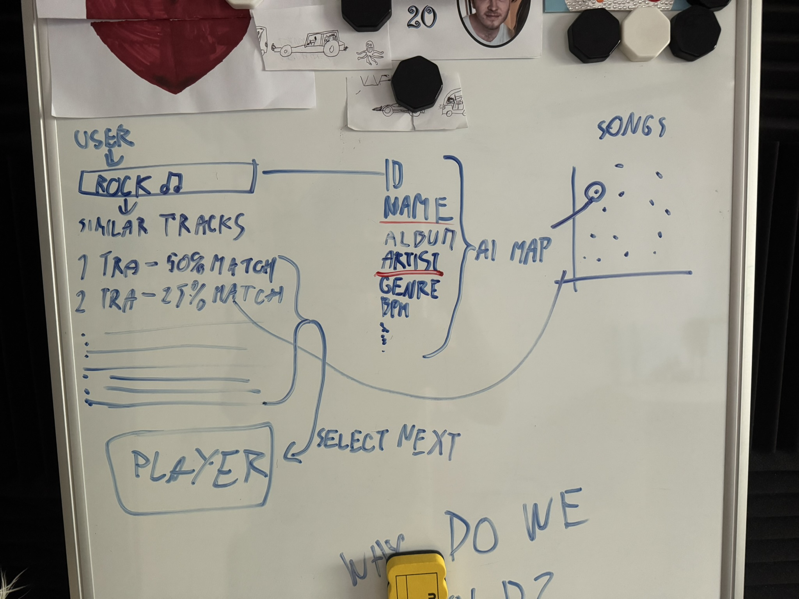
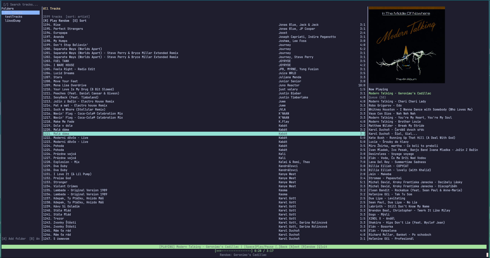

# Digital portfolio Solo Innovator Project Y1 P4 - Music Autoplayer

- Name: Peter Kapsiar
- Student ID: 5486866
- Repository: https://github.com/pop9459/P4-MusicAutoplayer
- Module: TICS Semester 2 · Period 4 - *AI Odyssey: AI2nnovate - Transforming Tomorrow*
- Master portfolio: https://github.com/pop9459/P4-Portfolio

This portfolio documents the **Solo Innovator challenge**, the individual assignment that
runs through the modulebook's COMPUTER track as the Design Thinking chain (weeks 4.1-4.7)
and finishes in "Your Own AI Project (P)". The product is **Music Autoplayer**: a local,
offline music recommender that decides which track should play next by comparing song
metadata, and plays it in a terminal interface.

**Honesty about the timeline.** I did not complete this assignment during Period 4. The
project was built afterwards as remedial work; the Git history runs from 21-07-2026 to
21-09-2026 and is a truthful record of that. The Design Thinking steps in weeks 4.1-4.4
below are therefore written retroactively — they describe the reasoning the project was
actually built on, reconstructed from the design document and the commit history, not a
diary kept at the time. The one step that could not be reconstructed at all was the set of
three interviews in week 4.1; those were held for real, after the fact, rather than
invented, and they changed what the analysis says.

**Scope of this document.** The repository is larger than the assignment asks for: it also
contains a three-column curses interface, an `mpv` playback backend, an MPRIS media-key
service and terminal cover-art rendering. Those are supporting infrastructure and are only
named here. The AI component — the recommender algorithm, how it scores similarity, how a
queue is assembled from it, and how it was measured — is documented in full, because that
is what the assignment is about.

**Development was AI-assisted.** See [AI-assisted development](#ai-assisted-development)
in week 4.7 for what that means in practice and which decisions are mine.

---

## Week 4.1 - Problem Exploration

**Theme:** From observations to insights. Interview people about their experiences with
AI, and write a short analysis of current challenges in AI.

### AI interviews - (P)

Three people, interviewed in September 2026, deliberately mixed in technical background.
Names are withheld; what the analysis uses is how technical each person is and how heavily
they use recommendation services.

The questions avoid the word "AI" on purpose. In ordinary use it now means a chatbot, and
the systems this project is about — the ones choosing your next song, video or post — are
precisely the AI that the largest number of people use daily and almost nobody calls AI.
Asking about "AI" would have produced three conversations about ChatGPT. The questions
asked were:

1. Which apps decide for you what comes next — next video, next song, next post? How well
   does each one do it?
2. Has one of those ever given you something that felt wrong, repetitive, or like it was
   pushing you? What was it, and what did it get wrong?
3. Those systems work by tracking what you watch and listen to. If a program could do the
   same job without keeping any record of you, would that matter to you, or not?

#### P1 - Parent, 50s, non-technical

**Q1 — Which apps decide for you what comes next?**
> Spotify works alright. Netflix — not so impressed by the recommendations.

**Q2 — Has one ever given you something that felt wrong, repetitive or pushy?**
> Doesn't like the Daily Mix from Spotify. Feels unoriginal, unfun, nothing new.

**Q3 — Would it matter to you if a program did the same job without keeping any record of you?**
> Doesn't like the feature that other people can see what she is listening to. Also had a
> Kindle feature that shared her reading activity, which is also not appreciated.

#### P2 - Friend, 20s, IT student

**Q1 — Which apps decide for you what comes next?**
> YouTube: amazing. Spotify: transitions between songs well. TikTok: it's okay.

**Q2 — Has one ever given you something that felt wrong, repetitive or pushy?**
> Spotify — you need to personally set the transitions between songs, and some songs don't
> blend well together since timing differs.

**Q3 — Would it matter to you if a program did the same job without keeping any record of you?**
> I guess it would matter in the sense that my data isn't being tracked so my info is
> confidential.

#### P3 - Friend, 20s, IT student

**Q1 — Which apps decide for you what comes next?**
> YouTube, Instagram, TikTok and Spotify.
>
> I hinge on YouTube and the recommendations have been pretty good, albeit I only watch
> stuff I actively follow so all recommendations are from my channels anyway.
>
> TikTok and Instagram are pretty similar, although lately I've found it easier to go down
> rabbitholes than before.
>
> Spotify is pretty mixed. Sometimes it plays great music, sometimes it goes out of my taste.

**Q2 — Has one ever given you something that felt wrong, repetitive or pushy?**
> I believe Instagram is the most prone to re-show content, even if it was shown just
> minutes ago. (This has probably to do with mass produced social media content.)

**Q3 — Would it matter to you if a program did the same job without keeping any record of you?**
> It definitely would. I don't believe most users understand the algorithms in the
> background therefore they could only benefit from not being spied on.

### Analysis: current challenges in AI - (P)

Four challenges. The first three are the assumptions I started from; the fourth came out of
the interviews and I had not written it down before. Where the interviews **weakened** one
of my assumptions, that is recorded too, because a contradicted assumption is worth more
than three people agreeing with me.

**1. Recommenders need your history, and history is surveillance.** Every large music
service recommends by collaborative filtering: it compares your listening behaviour to
other people's. That works well, and the price is a permanent, centrally stored record of
what you listened to, when and how often. The user cannot inspect it, correct it, or take
it with them. The challenge is that the dominant technique for this problem class is
inseparable from data collection.

*What the interviews did to this claim:* partly supported, and partly redirected. Only P3
endorsed it in the form I wrote it, and he added the reason I had not considered — "I don't
believe most users understand the algorithms in the background", which makes it a
transparency problem before it is a privacy one. P2 agreed only mildly ("I guess it would
matter"). P1, the non-technical participant, was the most strongly opinionated of the three
about her data and yet **not about tracking at all**: what she objects to is *other people
seeing* what she listens to, on Spotify and on her Kindle. That is social exposure, not
corporate data collection, and it is a different problem from the one I had framed. It is
worth noting that the product answers it anyway and by accident — with no account and no
server there is nobody to expose her listening to — but I would not have arrived at that
requirement from her answer, because I never asked the question that would have surfaced
it.

**2. Cold start.** A collaborative system knows nothing about a track nobody has played and
nothing about a listener who has just arrived. Niche and local music is systematically
disadvantaged: it is not recommended because it is not played, and it is not played because
it is not recommended.

*What the interviews did to this claim:* nothing. Not one of the three raised it
unprompted. It remains a real property of collaborative systems, but I should be honest
that it is a challenge I read about rather than one my users feel — and my own library,
which is full of Czech and Slovak music that streaming services barely index, is probably
the actual source of it.

**3. Nobody can say whether a recommender is actually good.** Recommendation quality is
subjective and rarely measured honestly. Offline metrics are easy to compute and easy to
fool; a system can score well and still produce queues nobody wants to listen to.

*What the interviews did to this claim:* supported it indirectly and sharply. All three
rated the same services differently and for incompatible reasons — P2 called YouTube
"amazing", P3 called it good but immediately undercut himself: "I only watch stuff I
actively follow so all recommendations are from my channels anyway." That is a listener
noticing, in his own words, that what looks like a strong recommender may only be
re-showing him his own choices. It is exactly the distinction that decides how this project
is evaluated in week 4.7: beating *random* is trivial, and the question worth asking is
whether the system beats a control that already filters to the right category. P3 arrived
at the design of my listening test without being asked about it.

**4. Recommenders go stale, and they repeat themselves.** This one came from the
interviews. P1's complaint about Spotify's Daily Mix — "unoriginal, unfun, nothing new" —
and P3's about Instagram — "the most prone to re-show content, even if it was shown just
minutes ago" — are the same failure at two different timescales: nothing new across weeks,
and the same thing twice within minutes. P3's Spotify answer adds a third: "sometimes it
goes out of my taste", which is the opposite failure, drift. So the real requirement is not
"be similar"; it is to stay in a neighbourhood while continuing to move inside it, and to
never serve the same thing twice.

That is the most directly actionable thing to come out of this step, and everything in the
shipped system that is not the scoring function exists because of it: the artist-repeat cap
and the work-key cooldown (week 4.6) answer the repetition half, and the seed anchor
answers the drift half.

### Notes on the week's assignments

- The challenges are not independent. Avoiding (1) forces you into (3): once you refuse to
  use listening history, you also refuse the usual way of evaluating a recommender, which
  is whether people clicked.
- Choosing a *content-based* approach answers (1) and (2) at once — similarity is computed
  from what is already in the file, so an unplayed track is exactly as recommendable as a
  popular one — but it does not answer (3) at all, and it does not answer (4) either.
  Content-based scoring is in fact *more* prone to repetition than collaborative filtering,
  because the most similar track to what is playing is very often by the same artist. That
  is the problem week 4.4 ran into.
- Doing the interviews late was still worth doing. Two of the three answers pushed back on
  my framing — P1 cared about being *seen*, not about being tracked, and nobody mentioned
  cold start — and one of them (P3 on YouTube) independently described the evaluation trap
  that the whole of week 4.7 is about.
- One answer turned out to be about tempo without using the word. P2's complaint that
  "some songs don't blend well since timing differs" is beat-matching, and it is the only
  independent reason anyone gave me to keep a tempo term in the scoring. That becomes
  relevant in week 4.7, where an offline metric argues for deleting it.

---

## Week 4.2 - How Might We & User Profiles

**Theme:** How do you draw up a clear AI-related problem statement? Formulate a "How Might
We" question and create two user profiles.

### "How Might We" question - (P)

> **How might we recommend the next song to a listener who owns their music files, using
> only what is already inside those files, so that nothing about their listening ever
> leaves their computer?**

Three parts of that sentence are load-bearing and each one is a constraint I held to:

- *"owns their music files"* — the input is a local folder, not a streaming catalogue.
- *"only what is already inside those files"* — artist, title, genre, year, tempo and album
  come from the embedded tags. No lookups, no external metadata service.
- *"nothing ever leaves their computer"* — no accounts, no telemetry, no cloud, and no
  stored listening history even locally.

### User profiles - (P)

**Profile 1 — Marek, 21, computer science student.**
Has about 2,500 MP3 and FLAC files collected over years, many from bandcamp, game
soundtracks, and rips of things that were never on streaming services. Lives mostly in a
terminal and dislikes running a browser to play music.
*Challenge:* his player has a shuffle button and nothing else. Shuffle puts a doom-metal
track after a lo-fi study track, so he ends up building playlists by hand and then playing
the same four playlists forever.
*Need:* something that plays continuously and stays roughly where he started, without him
curating it, and without uploading his library anywhere.

**Profile 2 — Ilona, 34, privacy-conscious former streaming subscriber.**
Cancelled her streaming subscription and re-bought her favourite albums as files. Not a
programmer; she can follow written instructions.
*Challenge:* she liked the "radio" feature of her old service and misses it, but she is not
willing to hand over a listening profile to get it back. Every offline player she tried
offers shuffle or nothing.
*Need:* the radio experience without the account behind it, plus reassurance that the
program is not quietly phoning home — something she can check by the fact that it works
with the network off.

### Notes on the week's assignments

- Both profiles converge on the same feature: an endless queue of *related* tracks, not a
  random one. That is the entire product.
- They diverge on the interface, and the divergence was resolved in favour of Marek — the
  shipped interface is a terminal UI. Ilona is served by the constraints (offline, no
  account) rather than by the presentation, which is an honest limitation rather than a
  claim that one product serves both equally well.

---

## Week 4.3 - Ideation

**Theme:** Brainstorming techniques. Generate ten AI solutions for the defined problem,
then select the three best and justify them.

### Ten AI solutions - (P)

1. **Metadata similarity recommender.** Score how similar two tracks are from their tags
   (genre, artist, tempo, year) and always play the most similar track that has not played
   yet.
2. **Audio-fingerprint recommender.** Analyse the waveform itself — tempo, spectral
   centroid, energy, key — and recommend on acoustic similarity.
3. **Local collaborative filtering.** Record what the user actually plays and skips, and
   learn a preference model from it over time.
4. **Genre-graph radio.** Build a graph of genres, walk it, and pick a random track from
   whichever genre the walk is currently on.
5. **k-means mood clusters.** Cluster the library into "moods" from tag and audio features,
   then play within a cluster.
6. **LLM DJ.** Feed the library listing to a language model and ask it to build a playlist
   with a natural-language prompt ("something calm for studying").
7. **Lyrics-based similarity.** Fetch or extract lyrics, embed them, and recommend on
   textual similarity.
8. **Classifier for missing tags.** Train a model that fills in missing genre tags from
   other metadata, improving whatever recommender sits on top.
9. **Reinforcement-learning skip agent.** Treat a skip as a negative reward and a full play
   as a positive one, and learn a policy for what to queue.
10. **Constraint-satisfaction playlist builder.** State constraints ("60 minutes, no artist
    twice, tempo rising") and solve for a playlist that satisfies them.

### The three best ideas - (P)

**1. Metadata similarity recommender (chosen).** It is the only idea on the list that
satisfies the How Might We question exactly as written: everything it needs is already in
the files, it works with the network disconnected, it stores no history, and it has no cold
start — a track that has never been played is scored the same way as any other. It is also
honest about being an *AI* assignment in the CS50 sense: it is a similarity-and-search
problem with a hand-designed representation and a weighted scoring function, which is
exactly the kind of system weeks 4.2-4.3 of the module are about. Its weakness is real and
known: it can only be as good as the tags, and it cannot hear the music.

**2. Audio-fingerprint recommender (second).** Strictly more information than idea 1, and
it degrades gracefully on untagged files, which metadata cannot. Rejected as the main
approach on cost: extracting features from every file takes seconds per track, so a
2,500-track library is an hours-long first run before the product does anything at all.
A reduced version of it did ship — `analyze-bpm` detects tempo from the audio with `aubio`
for files whose BPM tag is missing — which is the honest compromise: audio analysis where
it buys a specific missing feature, not as the foundation.

**3. Constraint-satisfaction playlist builder (third).** Genuinely interesting, and it maps
onto week 4.3's optimisation material. Rejected because it solves a different user problem
— it builds a *finite, specified* playlist, whereas both user profiles asked for an endless
queue they do not have to specify. Its ideas nevertheless came back: the artist-repeat cap
and the version cooldown described in week 4.6 are constraints layered on top of ranking,
which is a small piece of this idea surviving inside idea 1.

Ideas 3 and 9 were rejected on principle, not on difficulty: both are listening-history
models, which is the thing the How Might We question exists to avoid. Idea 6 was rejected
because it requires sending the library to a third party.

### Notes on the week's assignments

- The three ideas were not equally serious. Writing down why an idea is rejected turned out
  to be more useful than the ideas themselves — "rejected because it needs listening
  history" became a rule that settled several later arguments without re-opening them.
- Idea 2 surviving in reduced form is the most useful thing this step produced: a rejected
  idea kept as a *component* rather than a competitor.

---

## Week 4.4 - Low-Fidelity Prototype

**Theme:** Create a low-fidelity prototype (an AI flow schema, wireframe or basic script),
test it with a fellow student and record the feedback.

### AI flow schema - (P)

The low-fidelity prototype was a flow schema plus a throwaway script that printed
recommendations to the terminal — no player, no interface. The schema was drawn on a
whiteboard first:



Two things in that photo are worth pointing at, because both were later overturned by the
code. The **percentages** down the left ("1 TRA - 50% MATCH, 2 TRA - 25% MATCH") assume
similarity is a single number that always exists — there is no way to draw "this track has
no genre tag" on that list, which is the problem week 4.6 is mostly about. And the scatter
plot on the right, labelled **"AI MAP"**, is the feature-vector model: every track plotted
as a point in one shared space, with the nearest points being the recommendation. That is
the design the project started from, and abandoning it is the single largest change between
the plan and the shipped system.

The left-to-right flow, though — seed track, rank candidates, select next, hand it to the
player — survived intact, and is still an accurate description of the pipeline:

```
music folders ──scan──▶ data/library.json ──▶ track_similarity(a, b) ──▶ queue ──▶ mpv
   (read-only)          tracked folders +      per-pair, weighted           filters
                        merged catalog         metadata comparison
```

1. **Scan.** Walk a folder for `.mp3 .m4a .flac .wav .ogg .aac`, read artist and title from
   the filename (`Artist - Title.ext`) and genre/year/album/bpm/duration from the embedded
   tags via `mutagen`. Scanned folders are never written to; everything lands in one
   central `data/library.json`.
2. **Canonicalize.** Fold the long tail of raw genre tags into a structure that can be
   compared (week 4.6).
3. **Score.** `track_similarity(a, b)` compares two tracks' metadata directly.
4. **Assemble a queue.** Rank, then filter, then select.
5. **Play.** Hand the chosen file to `mpv`.

### Prototype feedback - (P)

The modulebook asks for this step to be a test with a fellow student. It was not: I tested
the prototype on my own library and my own listening, so what follows is self-testing
rather than peer feedback, and it is weaker evidence for exactly the reason the assignment
specifies a second person. Three problems surfaced anyway, and all three changed the
product:

- **It kept playing the same artist.** Not a scoring bug — a track sharing genre *and*
  artist with the current one really is the closest match. Led to the artist-repeat cap.
- **It played the same song twice**, as a remix and then the original, and once as a
  duplicate from two overlapping folders. Led to the work-key cooldown.
- **Untagged files behaved strangely.** Treating a missing genre as a genre called
  "unknown" made every untagged track a perfect match for every other. Led to the
  skip-and-renormalize rule.

### Notes on the week's assignments

- All three problems only appeared once the thing was actually playing music for a while;
  none of them is visible in the ranking output on its own. That is an argument for testing
  by listening rather than by reading scores, and it is the same argument that produces the
  blind listening test in week 4.7.
- The missing second person is a real gap. Someone else's library would have a different
  tag quality and a different genre distribution, which is precisely where the untagged-file
  problem came from on mine.
- All three fixes are structurally different: one is a queue-assembly filter, one is a
  second queue-assembly filter, and one is a change to the scoring function itself. Keeping
  that distinction clear — what is scoring and what is assembly — is the main thing I would
  point at if asked what I learned from prototyping.

---

## Week 4.6 - The AI Prototype: A Metadata Recommender

**Theme:** How do you build a working AI prototype? Work the prototype out in code — a
chatbot, image recognition or a **recommender system**.

### Your Own AI Project - (P)

#### Description

Music Autoplayer scans folders of audio files into one central JSON library, scores how
similar any two tracks are from their metadata, and plays a continuous queue of similar
tracks through `mpv` in a terminal interface. Nothing leaves the machine: no accounts, no
cloud services, no listening history, no collaborative filtering. The recommendation comes
entirely from what is already in the files.

The reference library used throughout this document is **2,599 tracks across 2 folders**,
with 202 distinct raw genre labels and 1,636 distinct artists.



The right-hand column is the recommender's output, and it is worth reading honestly rather
than as a demo. Seeded from "Modern Talking - Geronimo's Cadillac", the first half of the
queue stays firmly in 1980s pop while moving across artists and languages — Whitney
Houston, Vaya Con Dios, Matthew Wilder, then Czech and Slovak pop of the same era (Karol
Duchoň, Miro Žbirka, Elán, Michal David). That cross-artist, cross-language, same-era
behaviour is the year and genre terms working together, and it is the thing a genre filter
alone would not produce.

The second half drifts: Lana Del Rey, Billie Eilish, Dua Lipa, Labrinth. That is the
compounding drift described under seed anchoring below, visible in a real queue — and it is
the same effect the measurements in week 4.7 put a number on (similarity to the seed falls
from 0.634 over the first ten picks to 0.408 over the last ten). Note also that no artist
appears more than twice in a row anywhere in the 50-track queue despite Modern Talking
appearing three times in total, which is the artist-repeat cap doing its job.

#### Algorithm: per-pair similarity

The design document specified the textbook approach: build a fixed-length numeric vector
per track (one-hot genre, min-max normalized BPM and year, an artist index) and compare
vectors with cosine similarity. **The shipped system does not do that**, and the reason is
the most important thing in this project.

`track_similarity(a, b)` compares two tracks' metadata *directly*, as four independent 0-1
terms combined by a weighted average. There is no shared vector space and no cosine
similarity. Three things about real tag data broke the vector model:

**Missing data has no representation in a vector.** A one-hot genre vector must encode
"no genre tag" as *some* value. Whatever value it picks, every untagged track becomes a
perfect genre match for every other untagged track — in the reference library that is a
355-track clique all scoring 1.0. Encoding the missing signal as zero instead is equally
wrong in the other direction: it asserts "maximally dissimilar" when the truth is "not
measured". The per-pair form returns `None` for a term either side lacks, skips that term,
and renormalizes the remaining weights over what is left. That is *impossible* to express
as a fixed vector, because the dimensionality would have to change per pair.

**Year became recency rather than similarity.** As a single min-max scaled scalar, two 2024
tracks scored a large match and two 1960 tracks scored almost nothing — for the identical
zero-year gap. An explicit decay over the absolute *difference* has no such asymmetry.

**Tempo is circular, and a linear scalar is not.** 87 and 174 BPM are the same groove
counted two ways — a beat-detection and tagging ambiguity, not a musical difference. A
normalized scalar puts them at opposite ends of the scale. Wrapping the log2 ratio makes
octave-equivalent tempi match.

There is a useful side effect. Because nothing is persisted per track, the derived features
are recomputed on every load, so a fix to genre canonicalization takes effect on the next
run instead of requiring every tracked folder to be rescanned.

#### Feature weighting and the skip-and-renormalize rule

```python
FEATURE_WEIGHTS = {
    "genre": 0.45,
    "bpm": 0.25,
    "artist": 0.20,
    "year": 0.10,
}
```

The weights sum to 1.0, but they are never all used at once unless both tracks carry all
four signals. Each term is computed independently and returns `None` when either side lacks
the data:

| Term | How it is computed | Returns `None` when |
|---|---|---|
| genre | graded by the grouping tree: same label 1.0 > same subfamily 0.6 > same family 0.3 > a small table of cross-family bridges > 0.0 | either side is untagged |
| bpm | `exp(-d / 0.12)` where `d` is the wrapped log2 tempo ratio, so 87 and 174 BPM match | either side has no tempo |
| artist | Jaccard overlap between the two sets of credited artists | either side is untagged |
| year | `exp(-|Δyear| / 12)` | either side has no year |

The renormalization is what makes one weight table work on any library. If neither track
has a tempo, genre/artist/year simply share the whole budget between them; the moment the
tags exist, tempo starts pulling its full 0.25 without anything being retuned.

Two details in the table are less obvious than they look. Artist similarity is **Jaccard,
not overlap**, because credits arrive as one string (`"Skrillex, Boys Noize, Dylan Brady"`)
and plain overlap would score a solo track and a three-way collaboration a perfect 1.0 —
re-creating exactly the saturation the artist term is supposed to break up. Jaccard's 1/3
says "related, not the same", which is what a listener would say too. Splitting the credit
string at all matters: treating it as atomic made a solo track and a collaboration by the
same person completely unrelated, and that affects 27% of a real library.

#### Genre canonicalization and the grouping tree

Genre carries the largest weight, so how a raw tag becomes a comparable label decides most
of the behaviour. The naive approach — map every tag to one of a handful of canonical
genres — was tried and lost real information. Of the 198 distinct labels in an earlier
snapshot of the reference library, **89 occurred exactly once**, and **185 matched none of
the broad families**: roughly a fifth of the library sits in labels like "brostep", "hard
bass" or "indietronica" that are similar to *nothing* under a flat scheme. Collapsing them
into their broad family fixes the isolation but destroys the distinction, because
"electronic" alone is 23% of the library and every electronic track would then be equally
similar to every other.

The shipped version keeps both, in two stages:

1. **Canonicalize.** An alias map first, then — crucially — a label the grouping tree names
   explicitly keeps its own identity, and only then an ordered keyword-family fallback. The
   ordering matters: the keyword folding is deliberately broad, so without the tree check
   "synthpop" would be swallowed by "pop" and "indie rock" by "rock", destroying exactly
   the distinctions the tree exists to preserve.
2. **Group.** Each canonical label resolves to a `(subfamily, family)` pair —
   `"brostep" → ("bass", "electronic")`, `"hardstyle" → ("hard", "electronic")` — and
   similarity is graded down that hierarchy.

A small hand-authored adjacency table adds the handful of cross-family bridges a listener
would expect (`rock`/`pop` 0.2, `pop`/`electronic` 0.3, `jazz`/`score` 0.2) so
recommendations are not confined to one branch of the tree. It is deliberately sparse.
`"unknown"`, and non-genres such as `"speedrun"` and `"meme"`, are deliberately left out of
the tree so they stay isolated rather than being pulled toward anything.

#### Queue assembly: filters on top of ranking

Ranking by similarity, taking the top k and sampling from it — the whole of the original
design — is **not sufficient**, for reasons the peer test in week 4.4 found immediately.
Two filters sit between ranking and selection. Both are *queue-assembly* filters, not
scoring changes, and both fall back to the unfiltered pool rather than ever stalling
playback — a single-artist library must still play.

**Artist-repeat cap.** Counts how often each artist appears in a sliding window of recent
picks, and drops candidates by artists that already fill it. The first version counted the
*trailing run* instead, which a dominant artist walks straight past: with a cap of 3,
`A A A B B B A A A` is never blocked, because the run resets every time another artist gets
a turn. The window is twice the cap, which makes the cap a share of recent picks rather
than a run length.

**Work-key cooldown.** Suppresses other *versions* of a recently played song. "Thunderstruck",
"Thunderstruck (Live)" and "Thunderstruck - Radio Edit" are three tracks that must all stay
in the library, but they are one song and should never play back to back — and they score
near-identical similarity, so ranking alone plays them consecutively. `work_key` strips
bracketed sections, a trailing `" - <version>"` and a trailing `feat.` credit, and keys on
the *lead* credited artist, so `"Skrillex - Rumble"` and `"Skrillex, Fred again.. - Rumble"`
resolve to the same work. A work is suppressed only while it is recent; it stays reachable
later in the session.

**Seed anchoring, for generated queues.** Chaining each step off the previous pick lets
small similarity drifts compound, so a 60-track queue can end up sounding nothing like where
it started. `generate_queue_steps` blends 30% of each step's score with similarity to the
original *seed* track (`SEED_ANCHOR_WEIGHT = 0.3`). The blend is applied to the two
**scores**, not to the two feature sets: averaging two reference vectors produces a
synthetic reference no real track could have — "70% artist X, 30% artist Y" — whereas
blending scores asks a question every candidate can actually answer.

#### Code

Full sources are in the repository; the two functions below are the recommender itself.
Comments are as they appear in the code.

`src/track_analyzer.py` — scoring:

```python
def _bpm_similarity(a: TrackFeatures, b: TrackFeatures) -> float | None:
    """Similarity as a circular distance in octaves, so 90 and 180 BPM match.

    Half/double-time is a tagging and beat-detection ambiguity, not a real
    tempo difference -- a track counted at 174 and the same groove counted at
    87 should not sit at opposite ends of the scale. Wrapping the log2 ratio
    makes the two equivalent without folding (and so distorting) the stored
    value, which would otherwise put a seam between 138 and 142 BPM.
    """
    if not a.bpm or not b.bpm or a.bpm <= 0 or b.bpm <= 0:
        return None
    octaves = abs(math.log2(a.bpm / b.bpm)) % 1.0
    distance = min(octaves, 1.0 - octaves)
    return math.exp(-distance / _BPM_OCTAVE_DECAY)


def track_similarity(a: TrackFeatures, b: TrackFeatures) -> float:
    """Weighted similarity in [0, 1] between two tracks' metadata.

    Each term is an independent 0..1 signal; a term where either side has no
    usable data is skipped and the remaining weights are renormalized over
    what is left. That per-pair renormalization is why one weight table works
    whether or not the library has BPM tags: with none, genre/artist/year
    simply share the whole budget between them.
    """
    total_weight = 0.0
    total_score = 0.0
    for name, term in (
        ("genre", _genre_similarity(a, b)),
        ("bpm", _bpm_similarity(a, b)),
        ("year", _year_similarity(a, b)),
        ("artist", _artist_similarity(a, b)),
    ):
        if term is None:
            continue
        weight = FEATURE_WEIGHTS[name]
        total_weight += weight
        total_score += weight * term
    if total_weight == 0.0:
        return 0.0
    return total_score / total_weight
```

`src/predictor.py` — ranking, the artist cap, and selection:

```python
def rank_candidates_by_features(
    reference: TrackFeatures,
    catalog: Catalog,
    exclude_track_ids: Collection[str] = (),
    anchor: TrackFeatures | None = None,
    anchor_weight: float = 0.0,
) -> list[tuple[TrackRecord, float]]:
    """Rank every eligible track against `reference`, best first.

    When `anchor` is given, each candidate's score is blended with its
    similarity to the anchor. This replaces blending the two reference
    *vectors* together, which produced a synthetic reference no real track
    could have -- averaging two one-hot artist encodings described a track
    that is "70% artist X, 30% artist Y". Blending the two scores instead
    asks a question each track can actually answer.
    """
    blend = max(0.0, min(1.0, anchor_weight)) if anchor is not None else 0.0

    candidates: list[tuple[TrackRecord, float]] = []
    for track in catalog.tracks:
        if not track.enabled or track.id in exclude_track_ids:
            continue
        features = catalog.features_for(track)
        score = track_similarity(reference, features)
        if blend > 0.0:
            score = (1.0 - blend) * score + blend * track_similarity(anchor, features)
        candidates.append((track, score))

    candidates.sort(key=lambda item: item[1], reverse=True)
    return candidates


def _apply_artist_repeat_cap(
    ranked_candidates: Sequence[tuple[TrackRecord, float]],
    recent_artists: Sequence[str],
    max_consecutive_same_artist: int | None,
) -> Sequence[tuple[TrackRecord, float]]:
    """Drop candidates whose artist already fills the recent window.

    A track sharing genre and artist with the current one scores a near
    perfect match, so pure similarity ranking queues up one artist at a
    time. The cap used to look only at the trailing run, which a dominant
    artist walks straight past: with a cap of 3, "A A A B B B A A A" is
    never blocked, because the run resets every time another artist gets a
    turn. Counting occurrences across a window instead catches that.

    The window is twice the cap, so the cap is a share of recent picks
    rather than a run length. This is a queue-assembly filter (like the
    no-repeat-track exclusion), not a scoring change, and it falls back to
    the unfiltered list if it would empty the pool -- a single-artist
    library must still play.
    """
    if not max_consecutive_same_artist or max_consecutive_same_artist < 1:
        return ranked_candidates
    window = recent_artists[-(2 * max_consecutive_same_artist) :]
    if not window:
        return ranked_candidates
    counts = Counter(window)
    saturated = {artist for artist, count in counts.items() if count >= max_consecutive_same_artist}
    if not saturated:
        return ranked_candidates
    filtered = [item for item in ranked_candidates if item[0].artist not in saturated]
    return filtered or ranked_candidates


def recommend_next_track(
    current_track_id: str,
    catalog: Catalog,
    top_k: int = 5,
    randomness: float = 0.0,
    rng: random.Random | None = None,
    excluded_track_ids: Collection[str] = (),
    recent_artists: Sequence[str] = (),
    max_consecutive_same_artist: int | None = None,
    recent_work_keys: Collection[str] = (),
) -> TrackRecord:
    ranked_candidates = rank_candidates(current_track_id, catalog, excluded_track_ids)
    ranked_candidates = _apply_work_key_cooldown(ranked_candidates, catalog, recent_work_keys)
    ranked_candidates = _apply_artist_repeat_cap(ranked_candidates, recent_artists, max_consecutive_same_artist)
    if top_k > 0:
        ranked_candidates = ranked_candidates[:top_k]
    return _sample_weighted_candidates(ranked_candidates, randomness, rng or random.Random())
```

Running it:

```bash
pip install -r requirements.txt
python -m src.cli add-folder --path ~/Music    # scan a folder into the library
python -m src.cli analyze-bpm                  # optional: detect missing tempi
python -m src.cli play                         # start the player
```

#### Design choices and their alternatives

| Decision | Alternative considered | Why the alternative was rejected |
|---|---|---|
| Per-pair metadata comparison | Cosine over a shared feature space (the original design) | Cannot express "this signal is missing on this pair"; makes year a recency signal; cannot represent circular tempo |
| Grouping tree over genres | Flat canonical genre index | 89 of 198 labels occur once; flattening destroys the distinctions, not flattening isolates a fifth of the library |
| Standard library only, plus `mutagen` | numpy / pandas / sqlite (the original design) | Once similarity stopped being vector math there was nothing for numpy to do. At a few thousand tracks a linear scan per recommendation is imperceptible, and one JSON file is inspectable, diffable and trivially backed up |
| Queue-assembly filters | Fix saturation by re-weighting the scoring | The scores are correct — a same-artist same-genre track genuinely *is* the most similar. The problem is what to do with that, which is an assembly question |
| No listening history | Local collaborative filtering (idea 3), RL skip agent (idea 9) | Rejected on the project's own privacy constraint, not on difficulty |

### Notes on the week's assignments

- The single most instructive moment of the project was discovering that the textbook
  representation — feature vectors and cosine similarity — was the wrong tool, and that the
  reason only shows up against real data. Missing tags are not an edge case; they are the
  normal condition of a personal music library.
- The distinction between *scoring* and *assembly* is the structure of the whole
  recommender. Scoring answers "how similar are these two tracks", and it is not allowed to
  know anything about the session. Assembly answers "what should play next given what just
  played", and it is where every session-dependent rule lives. Keeping scoring session-free
  is also what makes it testable.

---

## Week 4.7 - Validation, Reflection and Pitch

**Theme:** Your Own AI Project (P). Pitch the project, and reflect on what you learned
about Design Thinking and AI. Week 4.5's test methodology — usability and A/B testing —
is applied here.

### Validation - (P)

This is the part I am most willing to defend, because "is the recommender any good?" was
unanswerable for most of the project and three separate instruments were needed to answer
it. They answer *different* questions, and reaching for the wrong one is why the question
stayed open so long.

**1. `tools/recommender_report.py` — falsification.** Measures the *shape* of what the
recommender does: coverage, how often the top-1 pick is a tie, what a simulated 60-pick
session looks like, whether anything repeats. It has no baseline and no ground truth, so it
can show that the recommender has gone degenerate but it can **never** show that it is
good. Current run on the reference library:

```
Coverage
  tracks                      2599
  with a tempo                2598 (99%)
  genre matches nothing       537 (355 of them untagged)

Saturation
  top-1 ties (>= 0.999)       23%
  mean top-1 similarity       0.848

Sessions (12 x 60 picks, top_k=5, randomness=0.15)
  similarity to seed, first 10   0.634
  similarity to seed, last 10    0.408
  similarity between neighbours  0.763
  distinct genre labels          3.5
  distinct artists               48.1

Repeats
  sessions replaying a song      0/12
```

**2. `tools/eval_holdout.py` — held-out ground truth.** `album` is read and stored but
deliberately **never scored on**, which makes album membership a human-curated "these belong
together" grouping the scorer has never been shown. Asking the metric to retrieve a track's
album-mates out of the whole library is a real question with a real answer, and a random
scorer supplies the floor. Ground truth: 924 tracks across 379 albums of 2+ tracks.

| Pool | Precision@1 | Random baseline | Recall@10 | MRR |
|---|---|---|---|---|
| full library | **0.710** | 0.003 | 0.846 | 0.757 |
| same artist only | **0.766** | 0.227 | 0.983 | 0.836 |

The same-artist pool is the harder test: it holds artist and year roughly constant, so the
baseline is 0.227 rather than 0.003. This metric is objective and instant, but it is still a
*proxy*, and its limitation is specific: albums are strongly artist- and year-coherent, so
it treats genre as largely redundant with artist and cannot credit a term whose job is
bridging *between* artists.

**3. `tools/ab_listen.py` — the arbiter.** A blind A/B listening test with an exact binomial
p-value. Two configurations generate a queue from the same seed track, titles are hidden,
the slot order is randomised per trial, and the listener says which side they preferred. It
is the only instrument here that judges listening *quality*. It is also slow — a few minutes
per trial — so it is reserved for what the other two cannot settle. Results (62 recorded
trials; ties are excluded from the binomial `n`, and they ran 33-40%):

| Control | Record | Ties | Two-sided p |
|---|---|---|---|
| `shuffle_all` — uniform over the whole library | 12-0 | 6/18 | **0.0005** |
| `shuffle_genre` — random *within the seed's genre* | 10-2 | 8/20 | **0.039** |
| `nobpm` — the same config with the tempo weight at 0 | 10-6 | 8/24 | 0.454 |

**The second row is the load-bearing one.** Beating uniform shuffle only proves the genre
term works — that is a filter, not a recommendation. Beating *same-genre* shuffle means the
non-genre terms (tempo, artist, year) are audible, which is the first evidence in the
project that the recommender does real work beyond filtering by genre. That is why the
answer to "is it any good?" is now yes rather than a shrug.

**The tempo weight: measured, and deliberately not changed.** The leave-one-feature-out
ablation in `eval_holdout.py` argued for dropping the tempo term entirely — removing it
*improves* album retrieval from 0.766 to 0.813, removing genre changes almost nothing
(0.756), and flat equal weights beat the tuned table (0.783). The easy dismissal ("albums
just are not tempo-coherent") is false: tempo similarity runs 0.555 within an album against
0.315 for random pairs, a clear lift. So the offline evidence for the change was real and
checked. The blind listening test then did not support it — `current` vs `w_bpm=0` finished
10-6 with 8 ties over 24 trials, **p=0.454**: no detectable difference, and what direction
there is *favours keeping* it. The weights were left at genre 0.45 / bpm 0.25 / artist 0.20
/ year 0.10 and the result was written down instead.

The generalisation is the lesson I would actually take to another project: **an offline
proxy metric can falsify a change but cannot optimise one.** A weight table fitted to
maximise album retrieval is fitted to album structure — artist- and era-coherence — not to
listening flow. Use the proxy to catch regressions, never as the objective.

One further result worth stating as a limitation rather than a feature: sessions are
narrow — about 3.5 distinct genre labels per 60 picks — and `top_k` and `randomness` do
**not** widen them. Measured at `top_k=25, randomness=0.6` the genre count is unchanged from
`5 / 0.0` while coherence drops, because at 0.45 weight nothing cross-genre ever reaches the
top 25. Breadth is structural here, not a tuning problem.

### Unit testing - (P)

```bash
python -m unittest discover -s tests
# Ran 502 tests in 8.430s -- OK
```

**502 automated unit tests** across 16 test modules, ~6,000 lines of test code against
~5,200 lines of source. The design that makes this possible is deliberate: the catalog,
library and recommender logic are pure functions over data structures, so they are tested
directly. Player behaviour is tested through `PlayerEngine` — the stateful queue and
playback logic, separated from the interface exactly so it can be tested — with a mocked
`mpv` IPC socket and a curses stub, rather than against a real terminal or a real audio
process.

What the suite covers: tag parsing and the filename fallback, genre canonicalization and
grouping, every similarity term including the missing-data paths, catalog serialization
across format versions, ranking, both queue-assembly filters, no-repeat queue generation,
the library's folder add/remove/rescan behaviour, settings validation and migration, the
background scan and tempo-analysis threads, the CLI commands, all four interface panels,
and the measurement tools themselves. `tests/test_ab_listen.py` additionally greps `src/`
to *enforce* that nothing in the product ever reads the listening-verdict log — the privacy
constraint is a test, not a promise.

Version control: **76 commits**, developed on feature branches and merged into `main`.

### Pitch summary - (P)

*The 10-minute pitch in written form.*

Every music service recommends by watching what you listen to. That is the deal: you get a
good radio, they get a permanent record of your listening. I wanted to know whether you can
have the first without the second.

Music Autoplayer is a recommender that never watches you. It reads the tags that are already
inside your files — genre, artist, tempo, year — scores how similar any two tracks are, and
plays a continuous queue of similar music. No account, no cloud, no listening history, and
it works with the network off. A track nobody has ever played is recommended exactly as
readily as a popular one, because popularity is not an input.

The interesting part is that the textbook way to build this does not survive contact with a
real music library. The standard approach turns each track into a vector and compares
vectors — but a real library has missing tags, and a vector has no way to say "this field is
missing", only to guess a value. Guess "unknown" and every untagged track becomes a perfect
match for every other. So the scorer compares two tracks directly, skips whatever either
side is missing, and re-weights what is left.

The hardest question was not building it — it was proving it works. I built three
measurement tools. One can only show that it has broken. One scores it against a ground
truth it has never seen: the album tag, which is human-curated and deliberately never used
for scoring. It retrieves an album-mate as the top result 71% of the time against a random
baseline of 0.3%. And one is a blind listening test: I could not tell which side was which,
and I preferred the recommender to random shuffle 12-0. More importantly, I preferred it
10-2 over random shuffle *within the same genre* — which is what proves it is doing
something beyond sorting by genre.

It also taught me when to ignore a metric. An offline evaluation told me to delete the tempo
term. The listening test said there was no audible difference, so I kept it and wrote down
why. A metric that can tell you something is broken cannot be trusted to tell you what is
best.

### Intended result vs achieved result

*Required by modulebook §5.*

| Intended (design document §2) | Achieved |
|---|---|
| Input: one track from the local library | Yes |
| Output: one suggested next track | Yes |
| A simple AI-backed algorithm in Python | Yes — though "simple" understates it: four weighted similarity terms plus a two-level genre grouping and two queue-assembly filters |
| Deterministic core (top-k) with optional randomness | Yes, `top_k` and `randomness` are both settings |
| *Might have:* local song database | Yes — one JSON library, though not the SQLite that was proposed |
| *Might have:* enable/disable flags | Yes — `enabled` is the eligibility gate throughout |
| *Might have:* preprocessing pipeline | Yes — scan, canonicalize, derive features on load |
| *Might have:* actual playback | Yes, and this is where the project most exceeded its plan |

**Where it exceeded the plan.** Playback was a "might have" described as "a simple CLI or
minimal playback wrapper". What shipped is a three-column terminal interface over an `mpv`
process driven by JSON IPC, with background-threaded folder scanning and tempo analysis,
live search, a settings screen, cover art via the Kitty graphics protocol, and MPRIS media
keys. The design document ruled out a "complex or graphical user interface"; a terminal UI
stays within the spirit of that — no GUI toolkit, no web stack — while being considerably
more than the design imagined. Multi-folder libraries also were not planned; the design says
"a configured music folder", singular.

**Where it fell short of the plan.** The proposed feature-vector representation was
abandoned, correctly, but that means the design document's §4.2 and §5.1-5.2 describe a
system that does not exist; §9 of that document is the correction and is the part to read.
Audio features beyond tempo — timbre, energy, key — are not extracted. Learned similarity
weights were attempted and deliberately abandoned, for the reason given above. The 23% top-1
tie rate is unresolved and probably unresolvable: two tracks whose every compared field
agrees score exactly 1.0, which is a statement about the metadata rather than a flaw in the
scoring — there is nothing left in the tags to tell them apart.

**Where it fell short of the assignment.** It was delivered late, which is the honest
headline. The Design Thinking steps were reconstructed rather than kept as I went, and the
week 4.1 interviews were held after the product was already built — which is the wrong
order, and shows: two of the three answers pushed back on assumptions that were by then
already baked into the code.

### AI-assisted development

The implementation of this project was written with AI assistance (Claude Code), under my
direction, and it would be dishonest to present the code as hand-typed. What that division
actually looks like:

**Mine.** The problem framing and the How Might We question, including the constraint that
no listening history may exist anywhere in the system — which is what rejected ideas 3, 6
and 9 in week 4.3. The decision to abandon the feature-vector design once it broke on
missing tags. The measurement methodology: that three instruments are needed, that the
offline proxy can falsify but not optimise, and that a blind listening test with a stated
p-value is the only thing that settles a scoring question. The decision to keep the tempo
weight despite the ablation, and to write down the numbers so it would not be re-litigated
from intuition. The choice of controls in the A/B test — in particular that the interesting
control is same-genre shuffle, not uniform shuffle. And the listening itself: I am the
listener in all 62 blind trials.

**AI-assisted.** Essentially all of the code: the module layout, the similarity functions,
the interface, the tests, and the docstrings quoted in this document.

**Consequences I accept.** I can explain and defend every algorithmic decision documented
here — the per-pair form, the skip-and-renormalize rule, the grouping tree, the two
queue-assembly filters, the seed anchor and the tempo decision — because those are the
decisions I made and the reasoning is recorded in the repository (`CLAUDE.md` and
`DESIGN_DOC.md` §9 are the written record). I would be slower to reconstruct the finer
implementation details of the interface and threading code from memory. That is the honest
boundary of what I own in this project, and I would rather state it than have it found.

### Self-reflection

*Required three times over: modulebook §5 ("each member posts a self-reflection"), week 4.7
Computer Science ("what have you learned about Design Thinking and AI?") and week 4.7
Professional Skills ("what worked well? what would you do differently?").*

> **To write.** Prompts and factual hooks are below each heading; delete the quoted blocks
> as you replace them with your own text. §5 says the portfolio must contain enough
> reflection "to determine the extent to which the student has completed the assignments
> independently" — given the AI-assistance disclosure above, this section is where that is
> judged, so it has to be in your own voice.

#### What I learned about Design Thinking

> The honest answer is that I ran it backwards: built first, interviewed last. Worth saying
> what that cost. Hooks you can use:
>
> - The interviews still produced findings — P1 cared about being *seen*, not tracked;
>   nobody raised cold start; repetition and drift emerged as a fourth challenge — but none
>   of it could change a product that already existed.
> - Which step would have changed the most if done in order? (My guess: week 4.3's
>   rejected-ideas list, which became the rule that settled later arguments.)
> - Did any part of the chain feel like paperwork rather than design? Say so if it did.

#### What I learned about AI

> Pick the ones you actually felt, not the ones that sound good. Candidates:
>
> - The representation is the design decision, not the metric. Everything that broke —
>   the untagged clique, year becoming recency, tempo not being circular — was a
>   representation failure that no choice of similarity function would have fixed.
> - Missing data is the normal case in a real library, not an edge case. 355 of 2,599
>   tracks have no usable genre.
> - "AI" in ordinary use now means a chatbot, and the systems that actually shape what
>   people see daily are the ones nobody calls AI. You noticed this yourself when
>   rewording the interview questions.
> - You could not tell whether the recommender was good until you built something to
>   measure it with.

#### What worked well

> Hooks: 502 unit tests and what that made possible; the three-instrument measurement
> setup; the decision to keep tempo at 0.25 against the ablation, backed by 10-6 with 8
> ties at p=0.454; the blind A/B beating same-genre shuffle 10-2 at p=0.039, which is the
> result that answers "is it any good?".

#### What I would do differently

> Hooks: build the evaluation harness first — everything before it was guesswork, some of
> it confident guesswork. Talk to people before building. Do the week 4.4 test with a
> second person, since their library would have had different tag quality. And the one
> that matters most: this was delivered late because a solo assignment with no weekly
> deliverable slid behind the group project. Say what you would put in place instead.
> (Note the 360° feedback in the Professional Skills portfolio says something adjacent —
> that you go along with what the group decides rather than pushing your own position. A
> solo assignment has no group to push against, and also nothing keeping you on it.)

#### Working with AI assistance

> The disclosure above states the split. This is the part where you say what it cost and
> what you would do differently next time. Hooks: it made you fast and shallow in places;
> the defence against shallowness turned out to be measurement rather than discipline —
> it matters less how the code was written if a blind test says the output is preferred
> 10-2 over a serious control. But you still have to be able to explain the decisions,
> and the honest line is that you own the design and the evaluation, not every line.

### Notes on the week's assignments

- The measurement work is the part of this project I would defend in front of anyone. Three
  instruments answering three different questions, with the limitations of each written down
  before the results are used.
- Week 4.5's methodology material (usability testing, A/B testing) landed here rather than in
  its own week, because that is where the project actually needed it.
- The one genuinely uncomfortable result — that an offline metric and a listening test
  disagreed — is the most valuable thing in the repository, and it is recorded with its
  numbers specifically so it cannot be re-argued from intuition later.
